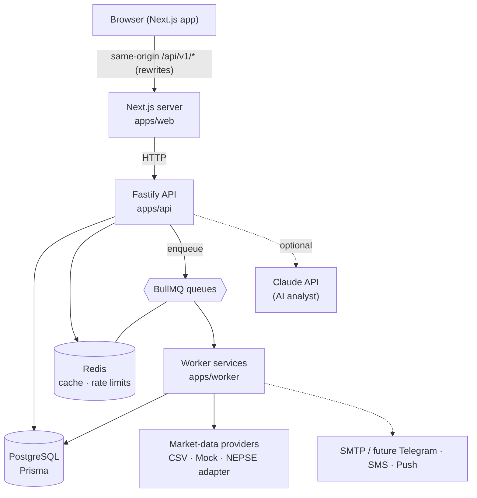
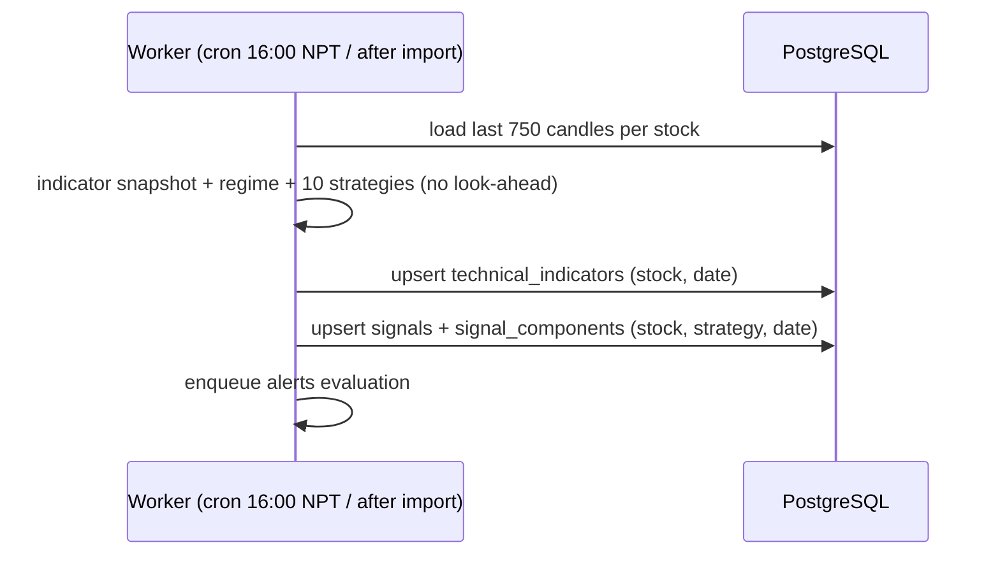

# Architecture

## Monorepo layout

| Path | Responsibility |
|---|---|
| `apps/web` | Next.js 15 App Router UI (TanStack Query, Zustand, Tailwind, lightweight-charts, Recharts) |
| `apps/api` | Fastify REST API: auth, validation (zod), OpenAPI, rate limiting, route handlers → services |
| `apps/worker` | BullMQ processors: sync, indicators/signals, backtests, screener, alerts, notifications, CSV import |
| `packages/shared` | Domain types (`OHLCV`, `TradingSignal`, …), `AppError`, UTC/NPT time helpers, market calendar |
| `packages/config` | zod-validated environment, queue names, job defaults |
| `packages/indicators` | Pure indicator functions + registry + snapshot |
| `packages/strategies` | Strategy plugin contract, 10 built-ins, regime detection, JSON condition DSL |
| `packages/backtesting` | Event-driven engine, Nepal fee schedules, metrics, walk-forward, signal-outcome analysis |
| `packages/market-data` | Provider abstraction, CSV parsing/validation, data quality, synthetic DEMO data |
| `packages/database` | Prisma schema/migrations, seed, shared data-access services (analysis, imports, backtest executor) |
| `packages/ml` | Optional ML: features, time-series splits, walk-forward evaluation, baseline + remote models |

Pure computation (indicators, strategies, backtesting) has no I/O and is unit-tested in isolation.
Route handlers stay thin: validation → service → response envelope. React components call hooks
(`apps/web/hooks/queries.ts`) and never contain domain logic.

## Request lifecycle

1. `onRequest`: request id (`x-request-id` honoured or generated), security headers, CORS, rate limit
   (Redis-backed, per user when a bearer token is present, else per IP).
2. zod validation of params/query/body (400 `VALIDATION_ERROR` on failure).
3. `authenticate` / `requireAdmin` preHandlers where needed.
4. Service call; `AppError`s map to the documented error envelope.
5. `onResponse`: structured log `{requestId, userId, route, status, durationMs}` and latency histogram (`/metrics`).

## Signal pipeline

The API never recalculates full-history indicators per request: it reads the stored snapshot/signals.
If a stock is missing analysis for the latest date the API fills small gaps synchronously
(Redis-locked) and delegates large gaps to the worker queue.

## Real-time strategy

MVP uses TanStack Query polling (60 s for market data, 1.5 s while a backtest runs). The API is
plain request/response, so Server-Sent Events or WebSockets can be added as new endpoints (e.g. a
`/api/v1/stream` SSE route fed by BullMQ `QueueEvents`) without changing existing routes.

## Time handling

All timestamps are stored in UTC; trading dates are `DATE` columns (UTC midnight). Display uses
the IANA zone `Asia/Kathmandu` via `luxon` (server) and `Intl.DateTimeFormat` (browser) — offsets
are never added manually. Cron schedules run in `Asia/Kathmandu`.
