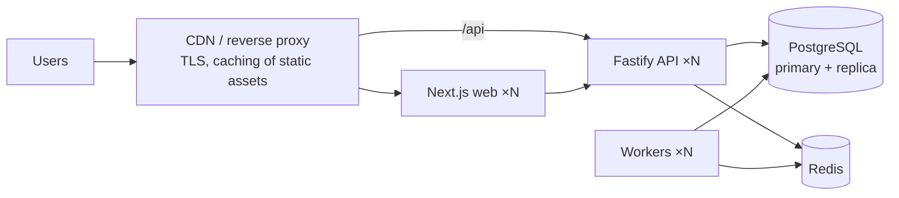

# Production deployment

## Images

| Image | Build | Runs |
|---|---|---|
| API | `docker build --target api -t nepse-api .` | migrations (`prisma migrate deploy`) + optional seed, then `node dist/server.js` |
| Web | `docker build --target web --build-arg API_INTERNAL_URL=http://api:4000 -t nepse-web .` | Next.js standalone server |
| Worker | `docker build -f Dockerfile.worker -t nepse-worker .` | BullMQ processors + cron schedulers |

Behind a TLS-inspecting proxy add `--secret id=extra_ca,src=corp-ca.pem`. Override base images
with `--build-arg NODE_IMAGE=...` (and `POSTGRES_IMAGE`/`REDIS_IMAGE` in compose) for mirrors.
In production set `SEED_DEMO_DATA=false` (and usually `SEED_ON_START=false`, running the seed once).

## Configuration & secrets

* All configuration is environment-based and validated at start-up (`packages/config`); the API
  refuses to start in production with the placeholder JWT secret.
* Keep secrets (`POSTGRES_PASSWORD`, `JWT_ACCESS_SECRET`, `ANTHROPIC_API_KEY`, `SMTP_PASSWORD`,
  `NEPSE_API_KEY`) in a secret manager (AWS Secrets Manager, Vault, Kubernetes Secrets) and inject
  them as environment variables. Nothing secret is exposed to the browser: the web app only knows the
  internal API URL; the AI key lives on the API.
* Set `COOKIE_SECURE=true` behind HTTPS and restrict `CORS_ORIGINS` to your domains.
* Rotate `JWT_ACCESS_SECRET` by deploying a new value (access tokens are short-lived, 15 min);
  refresh tokens are opaque, hashed in the DB, rotated on every use, and revoked per family on reuse.
* `LIVE_TRADING_ENABLED` must stay `false`: no live broker adapter exists. A future adapter must
  implement `BrokerAdapter` and be verified for legal/regulatory suitability first.

## Database

* Managed PostgreSQL 16 recommended. Run `prisma migrate deploy` once per release (the API entrypoint does it).
* Backups: daily `pg_dump -Fc` (or managed snapshots) + WAL archiving/PITR; test restores regularly.
  `docker compose exec postgres pg_dump -U nepse -Fc nepse > nepse-$(date +%F).dump`
* Point read-heavy analytics at a replica if needed; `daily_prices(stock_id,date)` and `signals`
  indexes support the main access paths.

## Redis

Used for BullMQ, caching and rate limits. Enable AOF persistence (`appendonly yes`) and
`maxmemory-policy noeviction` (required by BullMQ). Losing the cache is harmless; losing queued jobs
is recoverable (re-run jobs from Admin → Jobs).

## Scaling

* API and web are stateless — scale horizontally behind the load balancer. Rate limits and caches
  are shared via Redis.
* Workers scale horizontally; BullMQ guarantees each job runs once. Signal generation and imports
  run with concurrency 1 per worker; increase `WORKER_CONCURRENCY` for backtests/notifications.
  Scheduled jobs are registered idempotently with `upsertJobScheduler`, so multiple workers do not
  duplicate schedules.

## Logging & monitoring

* JSON logs (pino) with `requestId`, `userId`, route, status, `durationMs`; worker logs with `jobId`,
  queue, symbol, strategy, duration, status. Secrets, passwords, tokens and cookies are redacted.
  Ship stdout to Loki/ELK/CloudWatch.
* `GET /health` (liveness), `GET /ready` (DB + Redis), `GET /metrics` (Prometheus: HTTP latency
  histogram, BullMQ queue depth). Admin → System health shows DB/Redis latency, counts and failed jobs.
* Alert on: `/ready` failures, failed jobs in `job_runs`, queue depth growth, p95 latency.
