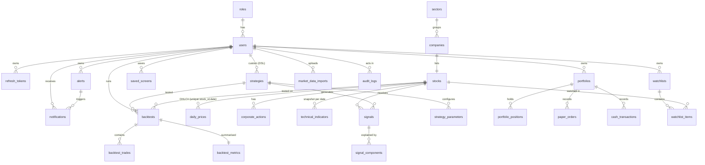

# Database ERD

PostgreSQL schema managed by Prisma (`packages/database/prisma/schema.prisma`,
migrations in `packages/database/prisma/migrations`). Core relationships:

Standalone tables: `market_indices` (official or derived index series, unique `name,date`),
`fee_schedules` (effective-dated, tiered, CGT holding periods, `is_verified`), `job_runs`
(BullMQ execution history), `market_holidays`, `app_settings` (calendar, regime methodology,
analytics results).

## Indexing highlights

| Table | Index / constraint | Purpose |
|---|---|---|
| `daily_prices` | `UNIQUE (stock_id, date)`, `INDEX (date)` | the (symbol, date) access path; idempotent imports |
| `technical_indicators` | `UNIQUE (stock_id, date)` | latest-snapshot lookups (`DISTINCT ON`) |
| `signals` | `UNIQUE (stock_id, strategy_id, timestamp)`, `(timestamp)`, `(strategy_id, timestamp)`, `(signal, timestamp)` | signal history + feeds |
| `refresh_tokens` | `UNIQUE (token_hash)`, `(family_id)` | rotation + reuse detection |
| `job_runs` | `UNIQUE (queue, job_id)`, `(queue, status)` | admin job views |
| `audit_logs` | `(user_id, created_at)`, `(action)` | audit queries |

Refresh tokens are stored as SHA-256 hashes; passwords as bcrypt (cost 12).
